<div align="center">


</div>

# Fusion Flight - Lane Dodge Game on AK Embedded Base Kit

<p align="center">
  
</p>

---

## Documentation

| File | Description |
|---|---|
| [README.md](README.md) | Main project overview, hardware information, gameplay rules, bitmap assets, build and flashing guide. |
| [application/sources/app/screens/scr_startup.cpp](application/sources/app/screens/scr_startup.cpp) | Startup logo and menu screen. |
| [application/sources/app/screens/scr_game.cpp](application/sources/app/screens/scr_game.cpp) | Main gameplay logic, vehicle bitmaps, collision, jump and difficulty system. |
| [application/sources/common/view_render.cpp](application/sources/common/view_render.cpp) | OLED rendering wrapper above Adafruit GFX. |
| [application/sources/app/task_display.cpp](application/sources/app/task_display.cpp) | Display task and button signal dispatch flow. |

## Introduction

**Fusion Flight** is a 1-bit lane-dodge arcade game built on the **AK Embedded Base Kit STM32L151**. The player controls a small vehicle moving against traffic, dodges incoming vehicles across multiple lanes, jumps over obstacles and survives as the game speed increases.

The project is used to practice embedded game programming concepts:

- **Event-driven design:** Buttons are converted into AK messages and dispatched to active screens.
- **Timer-based gameplay:** The game updates from a periodic software timer instead of blocking delays.
- **OLED rendering:** All screens are drawn into a 1-bit framebuffer before being pushed to the OLED.
- **Fixed memory thinking:** Vehicle objects are stored in a fixed-size pool instead of dynamic allocation.
- **Bitmap assets:** Pixel art is converted into C/C++ byte arrays and drawn with `drawBitmap()`.
- **Collision tuning:** Each sprite has its own hitbox so gameplay feels fair on a small display.

## Hardware

Fusion Flight targets the AK Embedded Base Kit with an STM32L151CBT6 MCU and a monochrome OLED.

<table align="center">
  <tr>
    <td align="center"></td>
  </tr>
</table>
<p align="center"><strong><em>Figure 1:</em></strong> AK Embedded Base Kit - top and bottom board view.</p>

### MCU Overview

```text
SoC Name : STM32L151CBT6
CPU      : Arm Cortex-M3
Flash    : 128 KB
RAM      : 16 KB
Display  : 128 x 64 monochrome OLED
Input    : 3 push buttons
```

### Flash Memory Map

```text
[ 0x08000000 - 0x08001FFF ] : Bootloader partition
[ 0x08002000 - 0x08002FFF ] : BSF shared partition
[ 0x08003000 - 0x0801FFFF ] : Application partition
                                  Fusion Flight firmware
```

When flashing with STM32CubeProgrammer:

| Binary | Address |
|---|---:|
| `ak-base-kit-stm32l151-boot.bin` | `0x08000000` |
| `ak-base-kit-stm32l151-application.bin` | `0x08003000` |

## Game Description

The OLED framebuffer is **128 x 64 pixels, 1-bit**. Fusion Flight uses a road with **4 lanes**. The player vehicle stays near the left side and can move between lanes, jump forward, and dodge vehicles moving from right to left.

<table align="center">
  <tr>
    <td align="center"></td>
  </tr>
</table>
<p align="center"><strong><em>Figure 2:</em></strong> Full 128 x 64 OLED layout with real lanes and current bitmap objects.</p>

### Current Runtime Constants

| Constant | Value | Meaning |
|---|---:|---|
| `ROAD_TOP_Y` | `7` | First road pixel row. |
| `ROAD_LANE_COUNT` | `4` | Number of lanes. |
| `LANE_HEIGHT` | `14 px` | Height of each lane. |
| `MAX_VEHICLES` | `7` | Fixed vehicle pool size. |
| `GAME_TICK_INTERVAL_MS` | `80 ms` | Periodic game update timer. |
| `PLAYER_JUMP_TICKS` | `16` | Jump animation duration. |

## How to Play

| Button / Signal | Action |
|---|---|
| `UP` / `SW3` | Move player to the upper lane. |
| `DOWN` / `SW2` | Move player to the lower lane. |
| `MODE` / `SW4` | Jump. At Game Over, restart. |
| Long `MODE` | Return to startup menu. |

Gameplay rules:

- The player scores when a vehicle is successfully passed.
- Moto and F1 vehicles can change lane at higher levels.
- Container vehicles are longer and harder to jump over.
- Jumping over large vehicles requires enough speed or a higher level.
- At Game Over, press UP, DOWN or MODE to restart.

## Difficulty System

| Level | Score Required | Behavior |
|---|---:|---|
| Level 1 | `0` | Basic vehicle speed and spawn rate. |
| Level 2 | `10` | Faster traffic; small vehicles start changing lanes. |
| Level 3 | `50` | Higher speed; large vehicles can be jumped over with enough motion. |
| Level 4 | `100` | Highest speed; denser traffic and occasional double spawn. |

Difficulty is implemented in:

```text
application/sources/app/screens/scr_game.cpp
```

Main functions:

```cpp
static void game_update_difficulty();
static int level_speed_bonus();
static void vehicle_try_change_lane(int index);
static bool jump_has_clear_speed();
```

## Game Objects

| Preview | Object | Bitmap | Size | Speed Step | Hitbox | Jumpable | Lane Change |
|:---:|---|---|---:|---:|---:|---|---|
|  | Player | `bitmap_player` | `17 x 18 px` | controlled | `x + 4`, width `11` | yes | manual |
|  | Jump Player | `bitmap_player_large` | `24 x 17 px` | controlled | animation only | yes | manual |
|  | Moto | `bitmap_moto` | `18 x 10 px` | `2` | `x + 3`, width `12` | yes | yes |
|  | F1 | `bitmap_f1` | `27 x 10 px` | `3` | `x + 4`, width `19` | yes | yes |
|  | Container | `bitmap_container` | `40 x 13 px` | `1` | `x + 4`, width `32` | level gated | no |

Vehicle type definition:

```cpp
struct game_vehicle_type_t {
    const unsigned char* bitmap;
    int width;
    int height;
    int step;
    int hit_x;
    int hit_w;
    bool jumpable;
    bool can_change_lane;
};
```

Configured vehicle types:

```cpp
static const game_vehicle_type_t vehicle_types[] = {
    {bitmap_moto,      18, 10, 2, 3, 12, true,  true},
    {bitmap_f1,        27, 10, 3, 4, 19, true,  true},
    {bitmap_container, 40, 13, 1, 4, 32, false, false},
};
```


### Full Frame Preview

The complete OLED mockup below is generated from the current firmware bitmap arrays and road constants. It shows the real 4-lane layout on a 128 x 64 framebuffer.

```text
resources/images/screens/scr_gameplay_layout.svg
```
### Bitmap Preview Files

The README previews below are generated from the same byte arrays used by firmware:

```text
resources/images/bitmap/player.svg
resources/images/bitmap/player_jump.svg
resources/images/bitmap/moto.svg
resources/images/bitmap/f1.svg
resources/images/bitmap/container.svg
```
## Bitmap Assets

The OLED is monochrome, so PNG/JPG assets are not loaded directly. Each asset must be converted into a C/C++ byte array and compiled into firmware.

Recommended conversion settings:

```text
Tool                : Image2CPP
Code output format  : Arduino code
Draw mode           : Horizontal - 1 bit per pixel
Canvas              : Match the intended object size
Background          : Black or Transparent
```

Recommended asset sizes:

| Object Type | Suggested Size |
|---|---:|
| Player | `17 x 18 px` |
| Small vehicle | `18 x 10 px` |
| F1 / fast vehicle | `27 x 10 px` |
| Container | `40 x 13 px` |

Example bitmap:

```cpp
static const unsigned char PROGMEM bitmap_f1[] = {
    0x03, 0x80, 0x07, 0x00,
    0x1f, 0xcf, 0xff, 0x00,
    // ... remaining bytes ...
};
```

Example draw call:

```cpp
int y = lane_center_y(vehicles[i].lane) - vehicles[i].type->height / 2;
view_render.drawBitmap(
    vehicles[i].x,
    y,
    vehicles[i].type->bitmap,
    vehicles[i].type->width,
    vehicles[i].type->height,
    WHITE
);
```

Important notes:

- `width` and `height` must match the converted bitmap.
- A wrong size can make OLED output look broken or read bytes from the next bitmap.
- One lane is currently `14 px` high. Any object taller than `14 px` may overlap lane lines.
- Build outputs such as `.bin`, `.elf`, `.axf`, `.o` and `.map` should not be committed to Git.

## Build on Linux

Build the application firmware:

```bash
cd ~/Documents/snake/application
make clean
make
```

The application binary is generated at:

```text
application/build_ak-base-kit-stm32l151-application/ak-base-kit-stm32l151-application.bin
```

Build the bootloader only when boot code changes:

```bash
cd ~/Documents/snake/boot
make clean
make
```

The boot binary is generated at:

```text
boot/build_ak-base-kit-stm32l151-boot/ak-base-kit-stm32l151-boot.bin
```

If `objcopy` reports `No space left on device`, check Linux disk usage:

```bash
df -h
sudo apt clean
sudo apt autoremove
```

## Flashing

Using STM32CubeProgrammer:

1. Connect with ST-LINK over SWD.
2. Flash bootloader at `0x08000000` if required.
3. Flash application at `0x08003000`.
4. Enable verify.
5. Use hardware reset or power cycle after flashing.

Typical application-only flashing:

```text
File          : ak-base-kit-stm32l151-application.bin
Start address : 0x08003000
```

## IV. Fusion Flight Runtime Sequence by Time Thread

This diagram is derived from the implemented flow in `scr_game_handle()`, `game_init()`, `game_update()`, `game_spawn_vehicle()`, `vehicle_try_change_lane()`, `game_check_collision()` and `view_scr_game()`. It describes the actual lane-dodge runtime used by Fusion Flight.

```mermaid
sequenceDiagram
    autonumber
    actor Player
    participant Button as Button Driver
    participant AK as AK Kernel / Timer
    participant Screen as scr_game_handle()
    participant Game as Game State
    participant Pool as Vehicle Pool[7]
    participant Collision as Collision / Jump Check
    participant Render as view_scr_game()
    participant OLED as OLED Framebuffer

    rect rgb(235, 245, 255)
        Note over Player,OLED: SCREEN_ENTRY - START GAME
        Player->>AK: Select Fusion Flight from startup menu
        AK->>Screen: SCREEN_ENTRY
        activate Screen
        Screen->>Game: game_init()
        Game->>Game: player_x=PLAYER_START_X, player_lane=1
        Game->>Game: score=0, level=1, spawn_period=28
        Game->>Pool: Clear all vehicle.active flags
        Screen->>AK: timer_set(AC_DISPLAY_GAME_TICK, 80 ms, periodic)
        Screen->>Render: Render initial gameplay frame
        Render->>OLED: Draw HUD, 4 lanes, player and vehicles
        deactivate Screen
    end

    rect rgb(240, 255, 240)
        Note over Player,OLED: PERIODIC GAME TICK - MAIN TIME THREAD
        loop Every AC_DISPLAY_GAME_TICK while game_over == false
            AK->>Screen: AC_DISPLAY_GAME_TICK
            activate Screen
            Screen->>Game: game_update()

            Game->>Game: game_update_difficulty()
            alt score >= 100
                Game->>Game: level = 4
            else score >= 50
                Game->>Game: level = 3
            else score >= 10
                Game->>Game: level = 2
            else score < 10
                Game->>Game: level = 1
            end
            Game->>Game: spawn_period = 28 - (level - 1) * 5, min 11

            opt UP and DOWN are both held while player is ahead
                Game->>Game: player_returning = true
            end

            alt player_jump_ticks > 0
                Game->>Game: Move player forward by jump_auto_dx[]
                Game->>Game: player_jump_ticks--
            else player_returning == true
                Game->>Game: Move player back by PLAYER_RETURN_STEP
                opt player_x <= PLAYER_START_X
                    Game->>Game: Stop returning at PLAYER_START_X
                end
            else pending jump tap exists
                Game->>Game: player_sw4_tap_ticks--
                opt tap countdown reaches zero
                    Game->>Game: player_jump_ticks = PLAYER_JUMP_TICKS
                end
            end

            Game->>Game: spawn_counter--
            opt spawn_counter <= 0
                Game->>Pool: game_spawn_vehicle()
                Pool->>Pool: Find inactive slot
                Pool->>Pool: Choose random lane
                Pool->>Pool: Reject spawn if lane_has_near_vehicle()
                Pool->>Pool: Choose Moto/F1/Container based on level
                Pool->>Pool: Activate vehicle at x = LCD_WIDTH - 1
                opt level >= 4 and random chance hits
                    Game->>Pool: Spawn one extra vehicle
                end
                Game->>Game: Reset spawn_counter with random offset
            end

            loop For each active vehicle
                Game->>Pool: vehicle_try_change_lane(index)
                alt vehicle can change lane and level >= 2
                    Pool->>Pool: Decrease lane_change_counter
                    opt counter reached zero and random chance passes
                        Pool->>Pool: Try adjacent lane
                        Pool->>Pool: Move lane only if target lane is clear
                    end
                end
                Game->>Pool: Move vehicle left by type.step + level_speed_bonus()
                opt vehicle passed player and scored == false
                    Game->>Game: score++
                    Pool->>Pool: vehicle.scored = true
                end
                opt vehicle exits left side
                    Pool->>Pool: vehicle.active = false
                end
            end

            Game->>Collision: game_check_collision()
            Collision->>Collision: Compute player hitbox with jump offset
            loop For each active vehicle in same lane
                Collision->>Collision: Compare player hitbox with vehicle hitbox
                alt hitbox overlaps and player is jumping
                    Collision->>Collision: Check vehicle.jumpable or jump_has_clear_speed()
                    opt jump is valid
                        Collision-->>Game: Continue, no crash
                    end
                else hitbox overlaps and jump is invalid
                    Collision-->>Game: Collision detected
                end
            end

            alt collision detected
                Game->>Game: game_over = true
                Game->>AK: timer_remove_attr(AC_DISPLAY_GAME_TICK)
            end

            Screen->>Render: view_scr_game()
            Render->>OLED: Draw score, level, lane lines, vehicles, player
            opt game_over == true
                Render->>OLED: Draw GAME OVER overlay
            end
            deactivate Screen
        end
    end

    rect rgb(255, 248, 235)
        Note over Player,OLED: BUTTON EVENTS - PLAYER CONTROL THREAD
        Player->>Button: Press UP / SW3
        Button->>AK: AC_DISPLAY_BUTON_UP_PRESSED
        AK->>Screen: Dispatch button message
        alt game_over == true
            Screen->>Game: game_init() and restart timer
        else player is not jumping and lane > 0
            Screen->>Game: player_lane--
        end

        Player->>Button: Press DOWN / SW2
        Button->>AK: AC_DISPLAY_BUTON_DOWN_PRESSED
        AK->>Screen: Dispatch button message
        alt game_over == true
            Screen->>Game: game_init() and restart timer
        else player is not jumping and lane < ROAD_LANE_COUNT - 1
            Screen->>Game: player_lane++
        end

        Player->>Button: Press MODE / SW4
        Button->>AK: AC_DISPLAY_BUTON_MODE_PRESSED
        AK->>Screen: Dispatch button message
        alt game_over == true
            Screen->>Game: game_init() and restart timer
        else player is jumping or returning
            Screen->>Game: Ignore press
        else player_x > PLAYER_START_X and second tap arrives
            Screen->>Game: player_returning = true
        else player_x > PLAYER_START_X
            Screen->>Game: Start short tap countdown
        else player is at start position
            Screen->>Game: player_jump_ticks = PLAYER_JUMP_TICKS
        end

        Player->>Button: Hold MODE
        Button->>AK: AC_DISPLAY_BUTON_MODE_LONG_PRESSED
        AK->>Screen: Dispatch long press
        Screen->>AK: Remove game tick timer
        Screen->>Screen: SCREEN_TRAN(scr_startup_handle, &scr_startup)
    end
```



### Runtime Notes

- The main game loop is timer-driven by `AC_DISPLAY_GAME_TICK` every `80 ms`.
- Vehicles are stored in a fixed array: `vehicles[MAX_VEHICLES]`, currently `7` slots.
- Score increases once per vehicle after it passes the player.
- Difficulty changes only from score thresholds: `10`, `50`, and `100`.
- Lane changing is enabled for Moto and F1 from level 2 onward.
- Container does not change lane and is not directly jumpable at low level.
- A jump avoids collision when the vehicle is jumpable, or when `jump_has_clear_speed()` allows large-object clearance.
- Rendering is separated from updates: `game_update()` mutates state, then `view_scr_game()` draws HUD, lanes, vehicles, player and Game Over overlay.
## Project Structure

```text
snake/
|-- application/
|   |-- sources/app/screens/
|   |   |-- scr_startup.cpp
|   |   |-- scr_game.cpp
|   |-- sources/common/view_render.cpp
|   |-- sources/app/task_display.cpp
|-- boot/
|-- hardware/
|   |-- bin/
|   |-- images/
|   |-- schematic/
|-- README.md
```

## Git Setup

```bash
git init
git add .
git commit -m "Initial Fusion Flight firmware"
```

The repository includes a `.gitignore` that excludes build outputs and temporary files.

## References

| Topic | Link |
|---|---|
| AK Embedded Base Kit | https://epcb.vn/products/ak-embedded-base-kit-lap-trinh-nhung-vi-dieu-khien-mcu |
| AK Blog and Tutorial | https://epcb.vn/blogs/ak-embedded-software |
