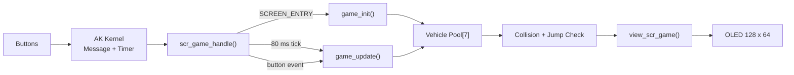

<div align="center">


</div>

# Fusion Flight

**Fusion Flight** is a small 1-bit lane-dodge game for the **AK Embedded Base Kit STM32L151**. The player controls a vehicle moving against traffic, dodges incoming vehicles, jumps over obstacles and survives as the game becomes faster.

<p align="center">
  
</p>

<p align="center">
  
</p>

## Main Features

- Event-driven screen flow using AK messages.
- Timer-based gameplay with `AC_DISPLAY_GAME_TICK` every `80 ms`.
- 128 x 64 monochrome OLED rendering through a 1-bit framebuffer.
- 4-lane traffic dodge gameplay.
- Player jump, restart and menu return controls.
- Fixed vehicle pool with Moto, F1 and Container objects.
- Difficulty levels based on score: `0`, `10`, `50`, `100`.

## Hardware Target

```text
MCU      : STM32L151CBT6
CPU      : Arm Cortex-M3
Flash    : 128 KB
RAM      : 16 KB
Display  : 128 x 64 monochrome OLED
Input    : SW2, SW3, SW4
```

Flash layout:

| Binary | Address |
|---|---:|
| `ak-base-kit-stm32l151-boot.bin` | `0x08000000` |
| `ak-base-kit-stm32l151-application.bin` | `0x08003000` |

## Gameplay

<p align="center">
  
</p>

Controls:

| Button | Action |
|---|---|
| `SW3 / UP` | Move up one lane |
| `SW2 / DOWN` | Move down one lane |
| `SW4 / MODE` | Jump / restart after Game Over |
| Long `SW4 / MODE` | Back to menu |

Rules:

- Score increases when the player successfully passes a vehicle.
- Moto and F1 can change lanes at higher levels.
- Container is longer and harder to clear.
- Jumping can avoid collision if the object is jumpable or the player has enough speed.

## Video Demo

<div align="center">
  <video
    src="https://github.com/user-attachments/assets/5d92aeeb-a82b-4d70-9fbb-fb683e4e7e60"
    controls
    width="700">
  </video>
</div>

## Game Objects

| Preview | Object | Bitmap | Size | Notes |
|:---:|---|---|---:|---|
|  | Player | `bitmap_player` | `17 x 18` | Controlled by buttons |
|  | Jump Player | `bitmap_player_large` | `24 x 17` | Jump animation |
|  | Moto | `bitmap_moto` | `18 x 10` | Small vehicle, lane change |
|  | F1 | `bitmap_f1` | `27 x 10` | Fast vehicle, lane change |
|  | Container | `bitmap_container` | `40 x 13` | Large vehicle |

Bitmap assets are converted from images into C/C++ byte arrays and drawn with `drawBitmap()`.

## Runtime Flow



Main gameplay code:

```text
application/sources/app/screens/scr_game.cpp
```

## Build

Build bootloader:

```bash
cd boot
make clean
make
```

Build application:

```bash
cd application
make clean
make
```

Generated binaries:

```text
boot/build_ak-base-kit-stm32l151-boot/ak-base-kit-stm32l151-boot.bin
application/build_ak-base-kit-stm32l151-application/ak-base-kit-stm32l151-application.bin
```

## Flash

Use STM32CubeProgrammer:

1. Flash bootloader at `0x08000000`.
2. Flash application at `0x08003000`.
3. Enable verify.
4. Reset or power-cycle the board.

For application-only updates, flash only:

```text
ak-base-kit-stm32l151-application.bin -> 0x08003000
```

## Project Structure

```text
snake/
|-- application/      # Application firmware and game screens
|-- boot/             # Bootloader firmware
|-- hardware/         # Board images, binaries and schematic assets
|-- resources/        # README bitmap previews and OLED layout preview
|-- README.md
```

## References

| Topic | Link |
|---|---|
| AK Embedded Base Kit | https://epcb.vn/products/ak-embedded-base-kit-lap-trinh-nhung-vi-dieu-khien-mcu |
| AK Blog and Tutorial | https://epcb.vn/blogs/ak-embedded-software |
