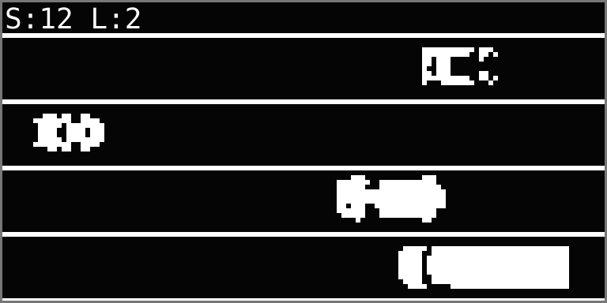
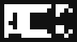
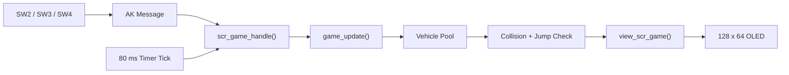

<div align="center">


# Reverse Lane

**1-bit OLED lane-dodge game for the AK Embedded Base Kit STM32L151**

Drive against traffic, dodge incoming vehicles, jump over obstacles and survive as the speed increases.

</div>

<p align="center">
  
</p>

## Table of Contents

- [Introduction](#introduction)
- [Demo](#demo)
- [Main Features](#main-features)
- [Gameplay](#gameplay)
- [Game Objects](#game-objects)
- [Runtime Flow](#runtime-flow)
- [I. Hardware](#i-hardware)
- [Build and Flash](#build-and-flash)
- [Project Structure](#project-structure)
- [Documentation](#documentation)

## I. Hardware

<p align="center">
  
</p>

<p align="center"><b>Figure 1:</b> AK Embedded Base Kit - STM32L151</p>

<p align="center">
  
</p>

The **AK Embedded Base Kit** is an evaluation kit for embedded software learners. It integrates a 1.54-inch OLED LCD, 3 push buttons and a buzzer, which are enough to study event-driven systems through a small real-time game. The board also exposes RS485, Qwiic and Grove connectors for broader prototyping.

### Specifications

| Item | Value |
|---|---|
| MCU | STM32L151CBT6 |
| CPU | Arm Cortex-M3 |
| RAM | 16 KB |
| Flash | 128 KB |
| Display | 128 x 64 monochrome OLED |
| Input | SW2, SW3, SW4 |

### Flash Partition Layout

| Memory Range | Size | Partition | Description |
|---|---:|---|---|
| `0x08000000 - 0x08001FFF` | 8 KB | Bootloader | AK bootloader partition |
| `0x08002000 - 0x08002FFF` | 4 KB | BSF Shared | Shared data between bootloader and application |
| `0x08003000 - 0x0801FFFF` | 116 KB | Application | Reverse Lane firmware |

## Introduction

**Reverse Lane** is a small embedded game built on the AK event-driven firmware architecture. The player controls a vehicle moving in the reverse direction while traffic approaches from the opposite side. The game uses real 1-bit bitmap sprites, lane-based collision logic, jump handling and score-based difficulty progression.

The project is designed for the **AK Embedded Base Kit STM32L151** with a **128 x 64 monochrome OLED**.

## Demo

<div align="center">
  <video
    src="https://github.com/user-attachments/assets/5d92aeeb-a82b-4d70-9fbb-fb683e4e7e60"
    controls
    width="700">
  </video>
</div>

## Main Features

- Event-driven screen flow using AK messages and timers.
- OLED gameplay rendered from 1-bit C/C++ bitmap arrays.
- Three-lane road layout with incoming traffic.
- Player movement, lane switching and jump animation.
- Moto, F1 and container objects with different sizes and behavior.
- Score-based level progression and increasing speed.
- Game-over, restart and menu navigation flow.

## Gameplay

<p align="center">
  
</p>

### Controls

| Button | Action |
|---|---|
| `SW3 / UP` | Move up one lane |
| `SW2 / DOWN` | Move down one lane |
| `SW4 / MODE` | Jump / restart after Game Over |
| Long `SW4 / MODE` | Back to menu |

### Rules

- Score increases when the player successfully avoids a vehicle.
- Moto and F1 can change lanes at higher levels.
- Container is longer and harder to clear.
- Jumping can avoid collision if the object is jumpable or the player has enough speed.
- Level increases as the score reaches game milestones.

## Game Objects

| Preview | Object | Bitmap | Size | Behavior |
|:---:|---|---|---:|---|
|  | Player | `bitmap_player` | `17 x 18` | Controlled by SW2, SW3 and SW4 |
|  | Jump Player | `bitmap_player_large` | `24 x 17` | Used during jump animation |
|  | Moto | `bitmap_moto` | `18 x 10` | Small traffic object, can change lanes |
|  | F1 | `bitmap_f1` | `27 x 10` | Fast traffic object, can change lanes |
|  | Container | `bitmap_container` | `40 x 13` | Long obstacle, harder to jump over |

Bitmap assets are converted from images into C/C++ byte arrays and drawn with `drawBitmap()`.

## Runtime Flow



Main gameplay code:

```text
application/sources/app/screens/scr_game.cpp
```

## Build and Flash

Build the application firmware from Linux:

```bash
cd application
make clean
make
```

Flash with STM32CubeProgrammer:

1. Flash bootloader at `0x08000000`.
2. Flash application at `0x08003000`.
3. Enable verify.
4. Reset or power-cycle the board.

For application-only updates, flash only:

```text
ak-base-kit-stm32l151-application.bin -> 0x08003000
```

## Project Structure

```text
snake/
|-- application/      # Application firmware and game screens
|-- boot/             # Bootloader firmware
|-- hardware/         # Board images, binaries and schematic assets
|-- resources/        # README bitmap previews and OLED layout preview
|-- docs/             # Markdown guides and DOCX report
|-- README.md
```

## Documentation

| Document | Purpose |
|---|---|
| [Getting Started Guide](docs/01-guide-getting-started.md) | Build, flash, project structure and where to start reading code |
| [Game Object Sequences](docs/02-design-sequence-object.md) | Detailed object design for Player, Jump Player, Moto, F1, Container and vehicle pool |
| [Runtime Signal Processing](docs/03-design-sequence-runtime.md) | AK message flow, button events, 80 ms game tick, render flow and game-over sequence |
| [DOCX Project Report](docs/Reverse_Lane_Game_Document.docx) | Full Word document for presentation/report submission |

## References

| Topic | Link |
|---|---|
| AK Embedded Base Kit | https://epcb.vn/products/ak-embedded-base-kit-lap-trinh-nhung-vi-dieu-khien-mcu |
| AK Blog and Tutorial | https://epcb.vn/blogs/ak-embedded-software |
