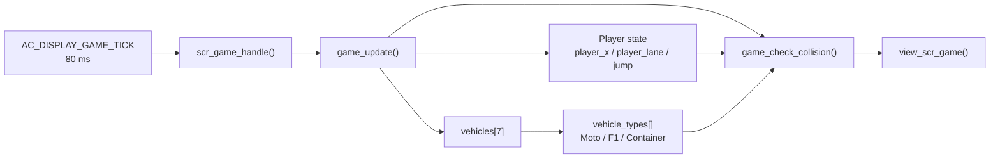
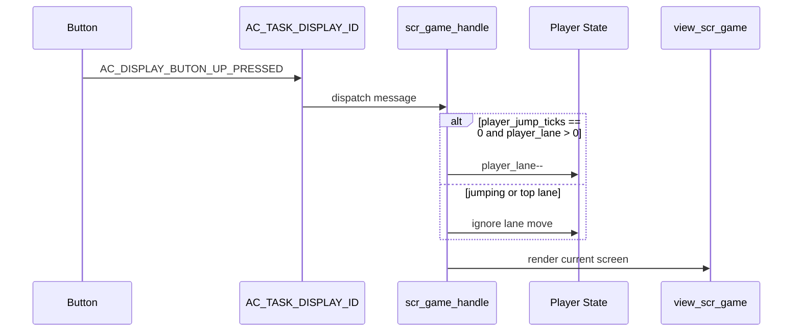
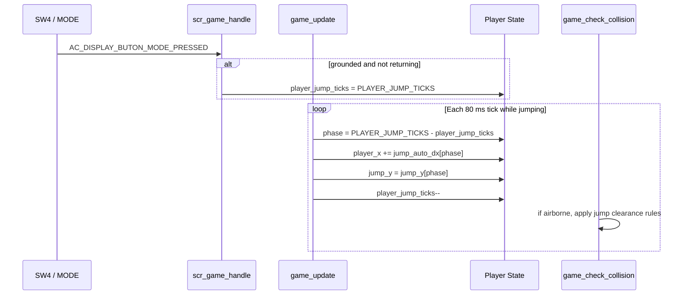
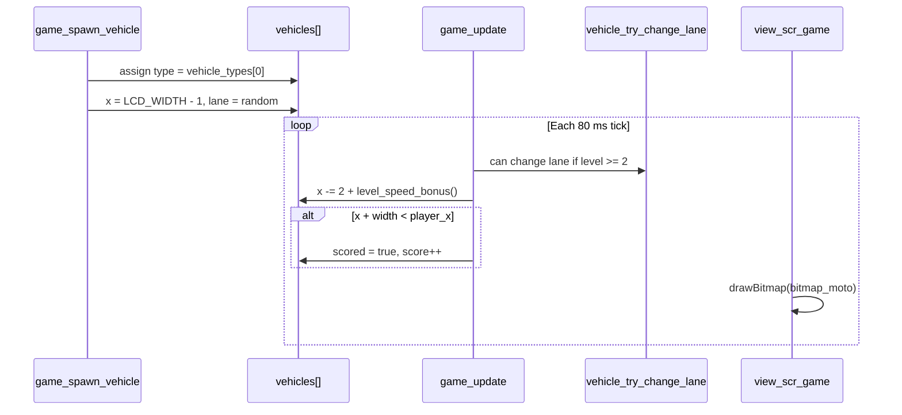
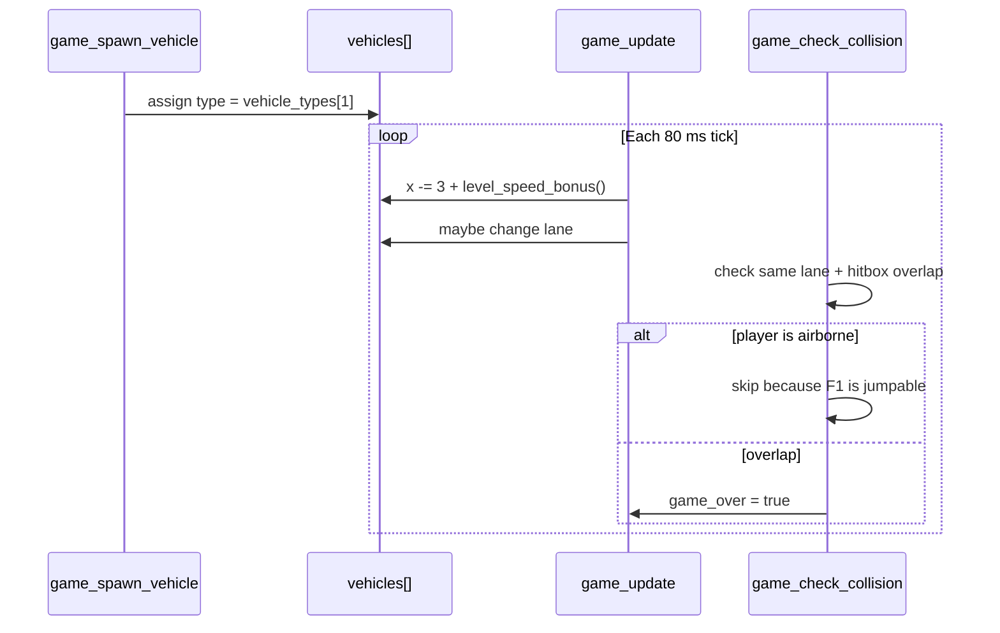
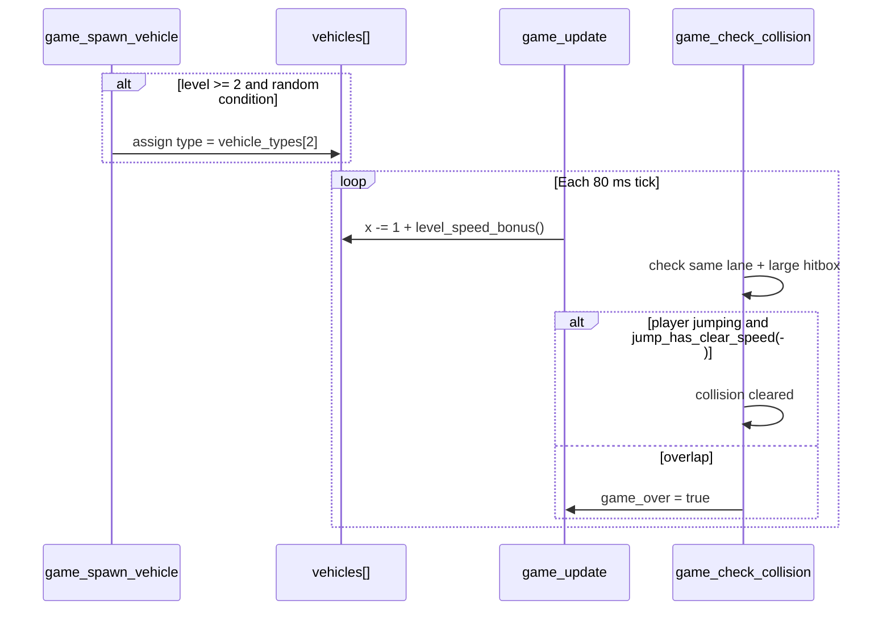
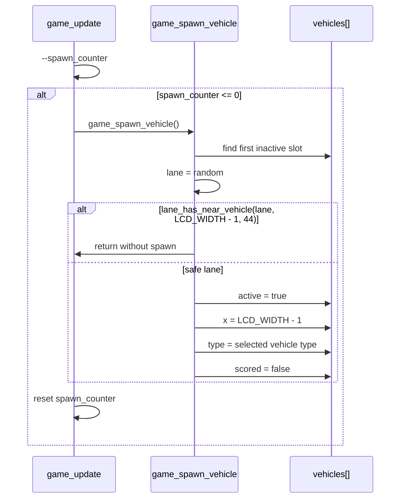
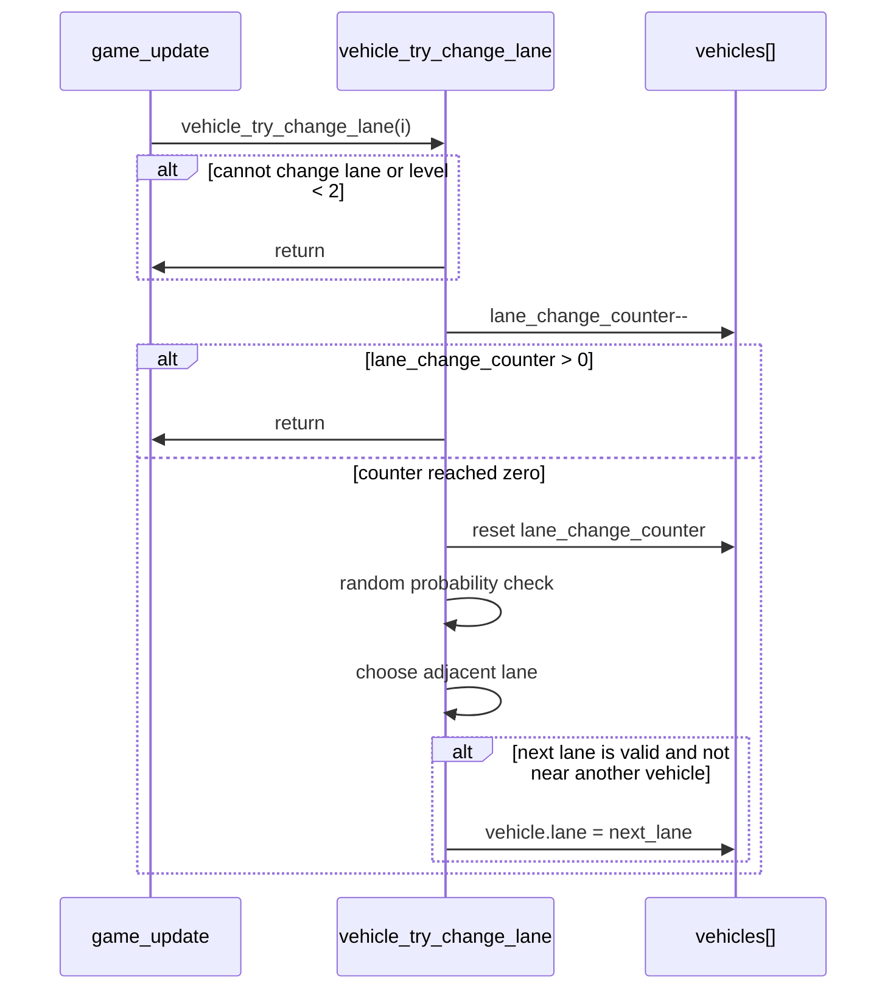
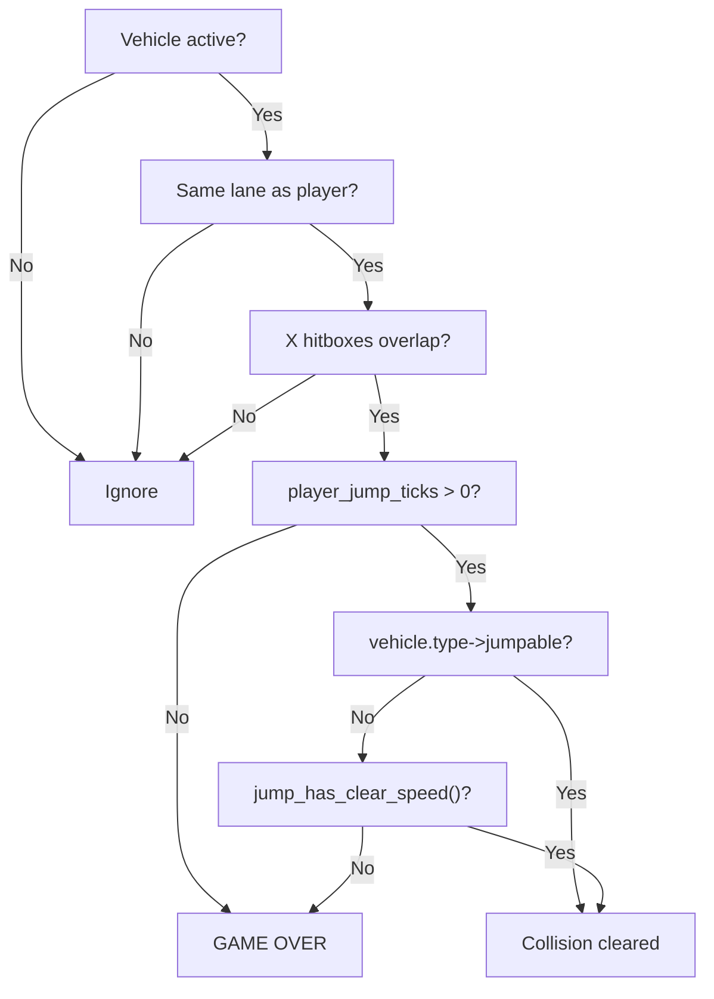

<h1 align="center">Reverse Lane - Game Object Sequences</h1>

This document describes every important gameplay object in **Reverse Lane**. Unlike some AK sample games where every object owns a separate task, Reverse Lane keeps gameplay objects inside `scr_game.cpp` and updates them from the screen's periodic game tick.

Main object code:

```text
application/sources/app/screens/scr_game.cpp
```

---

## Table of Contents

- [I. Object Summary](#i-object-summary)
- [II. Object Ownership Model](#ii-object-ownership-model)
- [III. Player Object Sequence](#iii-player-object-sequence)
- [IV. Jump Player Object Sequence](#iv-jump-player-object-sequence)
- [V. Moto Object Sequence](#v-moto-object-sequence)
- [VI. F1 Object Sequence](#vi-f1-object-sequence)
- [VII. Container Object Sequence](#vii-container-object-sequence)
- [VIII. Vehicle Pool Sequence](#viii-vehicle-pool-sequence)
- [IX. Lane Change Sequence](#ix-lane-change-sequence)
- [X. Collision Object Rules](#x-collision-object-rules)
- [XI. Code References](#xi-code-references)

---

## I. Object Summary

| Object | Storage | Bitmap | Size | Runtime responsibility |
|---|---|---|---:|---|
| Player | State variables | `bitmap_player` | `17 x 18` | Player lane, x-position, normal rendering and collision body |
| Jump Player | State variables | `bitmap_player_large` | `24 x 17` | Temporary airborne visual and jump clearance state |
| Moto | `vehicle_types[0]` | `bitmap_moto` | `18 x 10` | Small incoming vehicle, jumpable, can change lane |
| F1 | `vehicle_types[1]` | `bitmap_f1` | `27 x 10` | Fast incoming vehicle, jumpable, can change lane |
| Container | `vehicle_types[2]` | `bitmap_container` | `40 x 13` | Large incoming vehicle, normally not jumpable |
| Vehicle Pool | `vehicles[MAX_VEHICLES]` | Uses type bitmap | `7 slots` | Fixed active object pool, no dynamic allocation |

Current constants:

```cpp
#define ROAD_LANE_COUNT       (4)
#define LANE_HEIGHT           (14)
#define MAX_VEHICLES          (7)
#define GAME_TICK_INTERVAL_MS (80)
#define PLAYER_JUMP_TICKS     (16)
```

---

## II. Object Ownership Model

Reverse Lane does not create one AK task per object. The active game screen owns the object model.



Why this design is simple:

- All gameplay state is close together in one screen file.
- No `malloc` or dynamic object creation is needed.
- Vehicle data is reused through a fixed pool.
- Rendering can read state directly from the same file.

Tradeoff:

- It is less modular than a multi-task object design.
- If the game grows bigger, each object can later be split into a separate module or AK task.

---

## III. Player Object Sequence

The player is controlled by state variables, not by `vehicles[]`.

Important state:

| Variable | Meaning |
|---|---|
| `player_x` | Current horizontal position |
| `player_lane` | Current lane index |
| `player_jump_ticks` | Remaining jump ticks |
| `player_returning` | Whether player is returning to base x-position |
| `player_sw4_tap_ticks` | Small delay used in jump/return behavior |

Initial setup in `game_init()`:

```cpp
player_x = PLAYER_START_X;
player_lane = 1;
player_jump_ticks = 0;
player_returning = false;
player_sw4_tap_ticks = 0;
```

Player input rules:

| Signal | Condition | Result |
|---|---|---|
| `AC_DISPLAY_BUTON_UP_PRESSED` | Not game over and not jumping | `player_lane--` |
| `AC_DISPLAY_BUTON_DOWN_PRESSED` | Not game over and not jumping | `player_lane++` |
| `AC_DISPLAY_BUTON_MODE_PRESSED` | Not game over and grounded | Start jump logic |
| `AC_DISPLAY_BUTON_MODE_LONG_PRESSED` | In game | Stop game tick and return to menu |

Player sequence:



Render position:

```cpp
int player_y = lane_center_y(player_lane) - PLAYER_HEIGHT / 2 + jump_y;
draw_player(draw_x, player_y, jump_y < 0);
```

Collision body:

```cpp
int player_left = player_x + player_x_offset + 4;
int player_right = player_left + 11;
```

The collision body is smaller than the bitmap to make the game feel fair on a small OLED.

---

## IV. Jump Player Object Sequence

Jump Player is not a separate object in memory. It is the same player drawn with a larger bitmap while airborne.

Bitmap:

```cpp
bitmap_player_large
```

Size:

```text
24 x 17 px
```

Jump duration:

```text
16 ticks x 80 ms = about 1280 ms
```

Jump has two effects:

1. Visual: player appears lifted and enlarged.
2. Gameplay: collision can be ignored if the object is jumpable or speed is enough.

Jump sequence:



Vertical path:

```cpp
static const int jump_y[PLAYER_JUMP_TICKS] = {
    0, -2, -4, -6, -8, -9, -9, -8,
    -7, -5, -3, -1, 0, 0, 0, 0
};
```

Forward path:

```cpp
static const int jump_auto_dx[PLAYER_JUMP_TICKS] = {
    1, 2, 2, 2, 3, 3, 3, 2,
    2, 1, 1, 1, 0, 0, 0, 0
};
```

Large-object jump clearance:

```cpp
return level >= 3 || player_x >= PLAYER_START_X + 16;
```

This means Container becomes clearable only when the player has enough speed or has advanced far enough during the jump.

---

## V. Moto Object Sequence

Moto is the smallest incoming vehicle.

Definition:

```cpp
{bitmap_moto, 18, 10, 2, 3, 12, true, true}
```

Meaning:

| Field | Value | Meaning |
|---|---:|---|
| `bitmap` | `bitmap_moto` | Drawn sprite |
| `width` | `18` | Visual width |
| `height` | `10` | Visual height |
| `step` | `2` | Base movement speed |
| `hit_x` | `3` | Hitbox x offset |
| `hit_w` | `12` | Hitbox width |
| `jumpable` | `true` | Can be jumped over |
| `can_change_lane` | `true` | Can change lane from level 2 |

Moto sequence:



Gameplay role:

- Early object for learning dodge and jump.
- Small enough to fit cleanly inside one OLED lane.
- At higher levels, lane change makes it less predictable.

---

## VI. F1 Object Sequence

F1 is a faster incoming vehicle.

Definition:

```cpp
{bitmap_f1, 27, 10, 3, 4, 19, true, true}
```

| Field | Value | Meaning |
|---|---:|---|
| `bitmap` | `bitmap_f1` | Drawn sprite |
| `width` | `27` | Visual width |
| `height` | `10` | Visual height |
| `step` | `3` | Fastest base movement speed |
| `hit_x` | `4` | Hitbox x offset |
| `hit_w` | `19` | Hitbox width |
| `jumpable` | `true` | Can be jumped over |
| `can_change_lane` | `true` | Can change lane from level 2 |

F1 sequence:



Gameplay role:

- Faster than Moto.
- Forces earlier reaction.
- Still fair because it is jumpable.

---

## VII. Container Object Sequence

Container is the largest incoming vehicle.

Definition:

```cpp
{bitmap_container, 40, 13, 1, 4, 32, false, false}
```

| Field | Value | Meaning |
|---|---:|---|
| `bitmap` | `bitmap_container` | Drawn sprite |
| `width` | `40` | Longest object |
| `height` | `13` | Almost lane-height |
| `step` | `1` | Slowest base movement speed |
| `hit_x` | `4` | Hitbox x offset |
| `hit_w` | `32` | Large collision width |
| `jumpable` | `false` | Not normally jumpable |
| `can_change_lane` | `false` | Stays in spawn lane |

Container sequence:



Gameplay role:

- Acts like a wall object.
- Forces lane decision earlier than Moto/F1.
- Can be cleared in later levels only when the player has enough speed/timing.

---

## VIII. Vehicle Pool Sequence

Vehicles are stored in a fixed pool:

```cpp
static game_vehicle_t vehicles[MAX_VEHICLES];
```

Each vehicle slot:

```cpp
struct game_vehicle_t {
    bool active;
    int lane;
    int x;
    const game_vehicle_type_t* type;
    bool scored;
    int lane_change_counter;
};
```

Pool sequence:



Why fixed pool is good for embedded:

- Predictable RAM usage.
- No fragmentation.
- No heap allocation during gameplay.
- Easy to render by iterating `vehicles[]`.

---

## IX. Lane Change Sequence

Only Moto and F1 can change lane.

Condition:

```cpp
if (!vehicle->type->can_change_lane || level < 2) {
    return;
}
```

Lane change sequence:



Design reason:

- Moto/F1 can become unpredictable.
- Container stays stable so the game remains readable.
- `lane_has_near_vehicle()` avoids unfair overlap after lane change.

---

## X. Collision Object Rules

Collision checks only active vehicles in the same lane.

```cpp
if (!vehicles[i].active || vehicles[i].lane != player_lane) {
    continue;
}
```

Hitbox table:

| Object | Visual width | Hitbox offset | Hitbox width | Jump handling |
|---|---:|---:|---:|---|
| Player | `17` | `+4` | `11` | Uses jump state |
| Moto | `18` | `+3` | `12` | Jumpable |
| F1 | `27` | `+4` | `19` | Jumpable |
| Container | `40` | `+4` | `32` | Needs enough speed/timing |

Collision decision:



---

## XI. Code References

| Area | File |
|---|---|
| Object bitmap arrays | `application/sources/app/screens/scr_game.cpp` |
| Object type definitions | `application/sources/app/screens/scr_game.cpp` |
| Vehicle pool | `application/sources/app/screens/scr_game.cpp` |
| Spawn logic | `game_spawn_vehicle()` |
| Lane change logic | `vehicle_try_change_lane()` |
| Collision logic | `game_check_collision()` |
| Jump logic | `player_jump_offset()`, `jump_has_clear_speed()` |
| Render logic | `view_scr_game()` |

