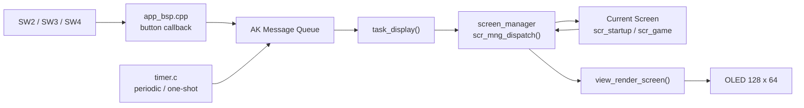
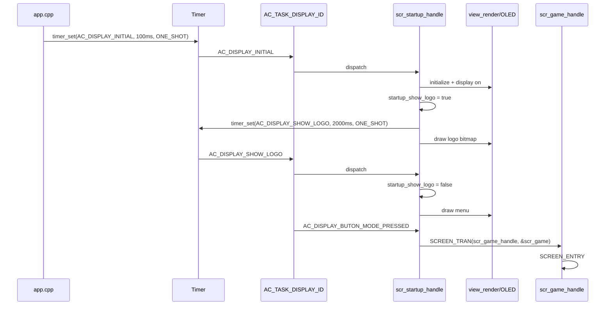
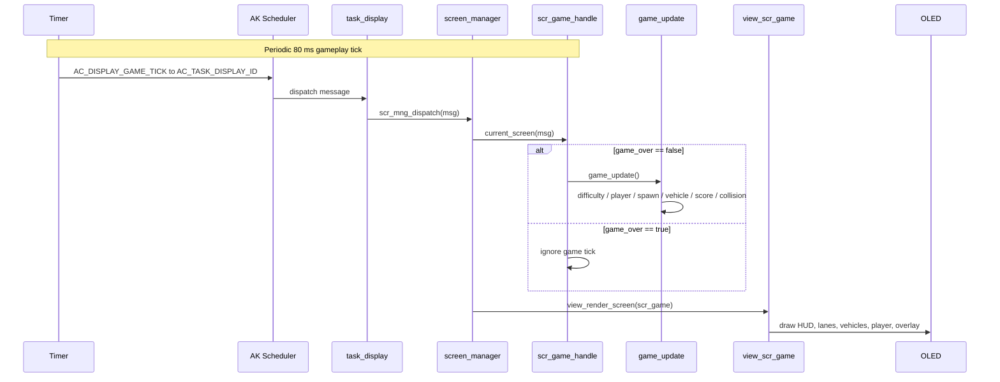
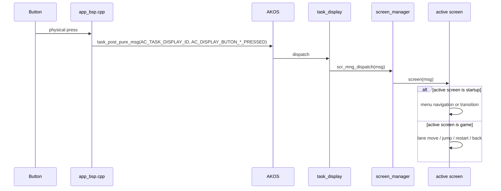
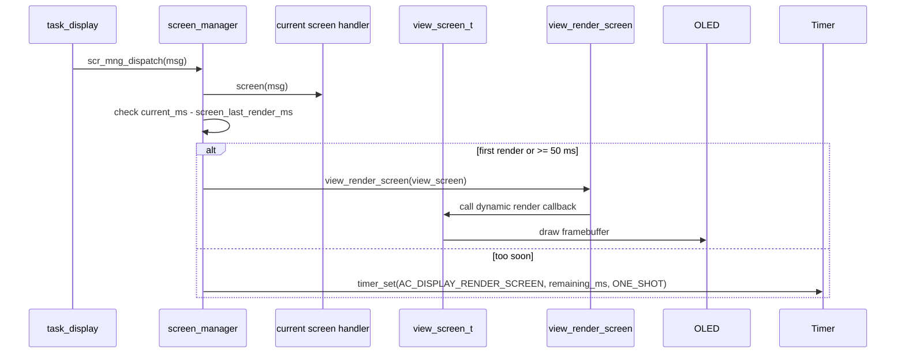
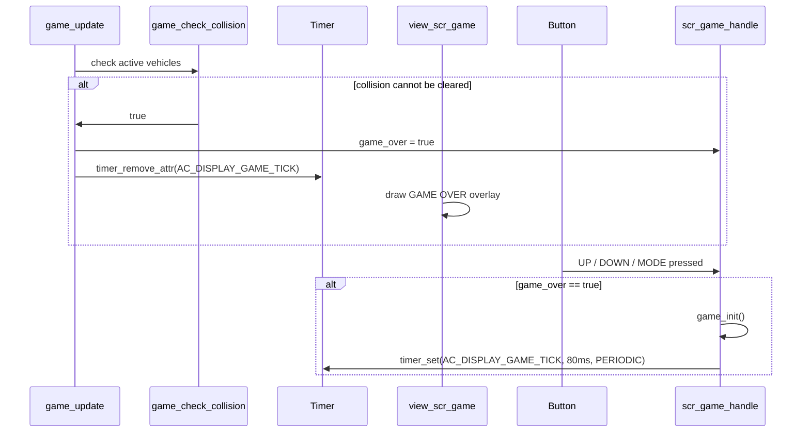
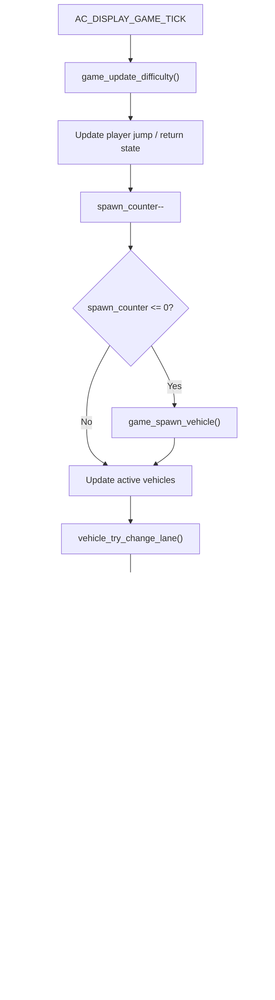

<h1 align="center">Reverse Lane - Runtime Signal Processing</h1>

This document explains how **Reverse Lane** processes startup, button input, game ticks, object updates, rendering and game-over behavior. The game uses the AK event-driven task architecture, but the gameplay objects are managed inside the game screen instead of separate object tasks.

---

## Table of Contents

- [I. Runtime Overview](#i-runtime-overview)
- [II. Main Runtime Architecture](#ii-main-runtime-architecture)
- [III. Game Start Sequence](#iii-game-start-sequence)
- [IV. Game Playing Sequence](#iv-game-playing-sequence)
- [V. Button Event Processing](#v-button-event-processing)
- [VI. Render Processing](#vi-render-processing)
- [VII. Game Over and Restart Sequence](#vii-game-over-and-restart-sequence)
- [VIII. Per-Tick Update Order](#viii-per-tick-update-order)
- [IX. Task Ownership](#ix-task-ownership)
- [X. Code References](#x-code-references)

---

## I. Runtime Overview

Reverse Lane uses the AK framework as an event-driven system:

1. Hardware buttons or timers create software signals.
2. Signals are posted to an AK task, mainly `AC_TASK_DISPLAY_ID`.
3. AK scheduler dispatches the message to `task_display()`.
4. `task_display()` forwards the message to `screen_manager`.
5. `screen_manager` calls the current screen handler.
6. The current screen updates its state.
7. `screen_manager` requests a render if the render interval allows.
8. `view_render` draws to OLED.

Main runtime signal:

```cpp
AC_DISPLAY_GAME_TICK
```

Game tick interval:

```cpp
GAME_TICK_INTERVAL_MS = 80 ms
```

Render throttle:

```cpp
AC_DISPLAY_MINIMUM_SCREEN_RENDER_INTERVAL_MS = 50 ms
```

---

## II. Main Runtime Architecture



Important idea:

```text
The BSP does not decide what screen is active.
It only posts button messages.
The active screen decides what each signal means.
```

---

## III. Game Start Sequence

Game start begins from the startup screen, not directly from `scr_game.cpp`.

Startup sequence:



Startup menu items:

```text
Reverse Lane
Cai dat
Thong ke
```

When `Reverse Lane` is selected, `SCREEN_TRAN()` changes current screen and sends `SCREEN_ENTRY` to the game screen.

---

## IV. Game Playing Sequence

On `SCREEN_ENTRY`, game screen initializes gameplay state and starts the 80 ms timer.

```cpp
case SCREEN_ENTRY: {
    game_init();
    timer_set(AC_TASK_DISPLAY_ID,
              AC_DISPLAY_GAME_TICK,
              GAME_TICK_INTERVAL_MS,
              TIMER_PERIODIC);
} break;
```

Gameplay sequence:



The game keeps objects inside the screen file:

```text
scr_game.cpp
|-- player state
|-- bitmap arrays
|-- vehicle_types[]
|-- vehicles[MAX_VEHICLES]
|-- game_update()
|-- game_check_collision()
|-- view_scr_game()
```

---

## V. Button Event Processing

Button callbacks post signals to the display task.

| Button | BSP callback | Posted signal | Destination |
|---|---|---|---|
| SW4 / MODE short | `btn_mode_callback()` | `AC_DISPLAY_BUTON_MODE_PRESSED` | `AC_TASK_DISPLAY_ID` |
| SW4 / MODE long | `btn_mode_callback()` | `AC_DISPLAY_BUTON_MODE_LONG_PRESSED` | `AC_TASK_DISPLAY_ID` |
| SW3 / UP | `btn_up_callback()` | `AC_DISPLAY_BUTON_UP_PRESSED` | `AC_TASK_DISPLAY_ID` |
| SW2 / DOWN | `btn_down_callback()` | `AC_DISPLAY_BUTON_DOWN_PRESSED` | `AC_TASK_DISPLAY_ID` |

Button sequence:



Game screen button behavior:

| Signal | Game state | Action |
|---|---|---|
| `AC_DISPLAY_BUTON_UP_PRESSED` | `game_over == true` | Restart game |
| `AC_DISPLAY_BUTON_UP_PRESSED` | grounded | Move up one lane |
| `AC_DISPLAY_BUTON_DOWN_PRESSED` | `game_over == true` | Restart game |
| `AC_DISPLAY_BUTON_DOWN_PRESSED` | grounded | Move down one lane |
| `AC_DISPLAY_BUTON_MODE_PRESSED` | `game_over == true` | Restart game |
| `AC_DISPLAY_BUTON_MODE_PRESSED` | grounded | Start jump |
| `AC_DISPLAY_BUTON_MODE_LONG_PRESSED` | in game | Stop game tick and return to menu |

---

## VI. Render Processing

Rendering is controlled by `screen_manager.cpp`.

After every dispatched display message:

```cpp
screen_manager->screen(msg);
scr_mng_render_screen();
```

Render sequence:



Game render draws:

1. Score and level HUD.
2. Four lane bands using horizontal lines.
3. Active vehicles from `vehicles[]`.
4. Player or jump-player bitmap.
5. Game Over overlay if needed.

---

## VII. Game Over and Restart Sequence

Game over happens inside `game_update()` after collision check.

```cpp
if (game_check_collision()) {
    game_over = true;
    timer_remove_attr(AC_TASK_DISPLAY_ID, AC_DISPLAY_GAME_TICK);
}
```

Game-over sequence:



Return to menu:

```cpp
case AC_DISPLAY_BUTON_MODE_LONG_PRESSED: {
    timer_remove_attr(AC_TASK_DISPLAY_ID, AC_DISPLAY_GAME_TICK);
    SCREEN_TRAN(scr_startup_handle, &scr_startup);
} break;
```

---

## VIII. Per-Tick Update Order

Every `AC_DISPLAY_GAME_TICK` runs this order inside `game_update()`:

1. `game_update_difficulty()`
2. Check SW2 + SW3 hold return condition
3. Apply jump forward movement
4. Count down jump / returning / SW4 tap state
5. Decrement `spawn_counter`
6. If needed, call `game_spawn_vehicle()`
7. Level 4 may spawn one extra vehicle
8. For each active vehicle:
   - `vehicle_try_change_lane(i)`
   - Move x left by `vehicle.type->step + level_speed_bonus()`
   - Add score if vehicle fully passed player
   - Deactivate if off-screen
9. Run `game_check_collision()`
10. If collision is true:
    - `game_over = true`
    - remove game tick timer

Per-tick flow:



---

## IX. Task Ownership

| Task / Module | Responsibility | Owns data | Receives |
|---|---|---|---|
| `AC_TASK_DISPLAY_ID` | Screen manager dispatch and rendering | Current screen pointer through screen manager | Display button signals, startup signals, game tick |
| `scr_startup.cpp` | Logo and menu state | `startup_show_logo`, `startup_menu_index` | `AC_DISPLAY_INITIAL`, button signals, logo timer |
| `scr_game.cpp` | Gameplay state and object model | Player state, vehicle pool, score, level, game_over | `SCREEN_ENTRY`, game tick, button signals |
| `app_bsp.cpp` | Button event translation | Button driver objects | Hardware button state from button driver |
| `screen_manager.cpp` | Current screen and render throttle | Current/old screen handler and view screen | Messages from `task_display()` |
| `timer.c` | Periodic and one-shot software timers | Timer pool | `timer_set()`, `timer_remove_attr()` |

Important difference from multi-object-task games:

```text
Reverse Lane:
    screen owns gameplay objects directly.

In The Depth style:
    each object can own a task and receive object-specific signals.
```

Reverse Lane is intentionally simpler because it is a smaller game.

---

## X. Code References

| Area | File |
|---|---|
| Task IDs and task registration | `application/sources/app/task_list.h`, `task_list.cpp` |
| Display signal definitions | `application/sources/app/app.h` |
| Button callback logic | `application/sources/app/app_bsp.cpp` |
| Startup logo and menu | `application/sources/app/screens/scr_startup.cpp` |
| Main game screen logic | `application/sources/app/screens/scr_game.cpp` |
| Screen manager | `application/sources/common/screen_manager.cpp` |
| AK task queue | `application/sources/ak/src/task.c` |
| AK timer | `application/sources/ak/src/timer.c` |
| AK message pool | `application/sources/ak/src/message.c` |
| OLED render layer | `application/sources/view/view_render.cpp` |

